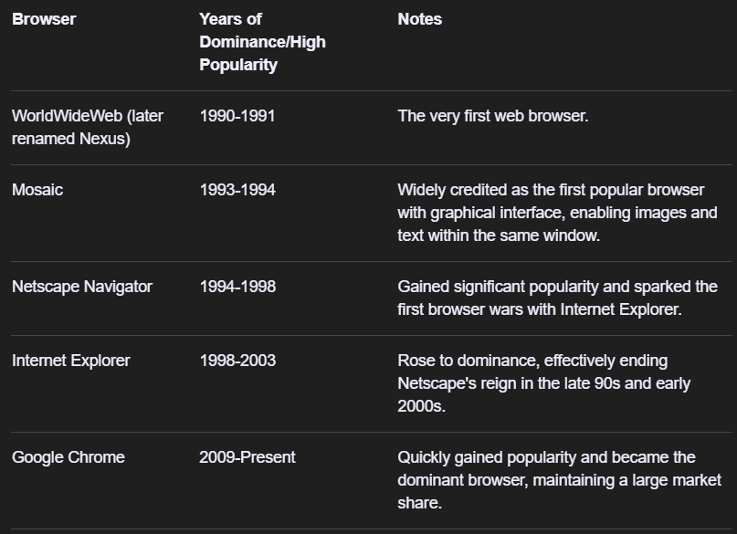
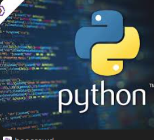

# Day 1 👌

## intro to browsers

### what languages does the browser understand
```

HTML,CSS,JS
```

###Shortcuts
- `alt + Up/Down -move lines
- `win + . -emoji🤣

### rendering Engine takecare of html,css

### jsengine in chromium
> Note:firefox was built on Rust language
chrome rendering engine is

- rendering-blink
- js engine-V8
```py
print("Hello, World")

```

```js
console.log("Hello, World")
```

## Usecase for Markdown

-AI
-Notes
-Blog
-slides
-Docs


#web app vs website vs mobile app
# kotlin?
# three layer archtecture
 -frontend/backend/database
 -
 # webpack + BABEL (translator/compiler)

 #DX-developer Experience

 #UX-user experience

 #where to get domain name? Godaddy ,
 IP address
 ipv4/ipv6
 why ipv6?
 public/private
 static/dynamic

 #mac address


