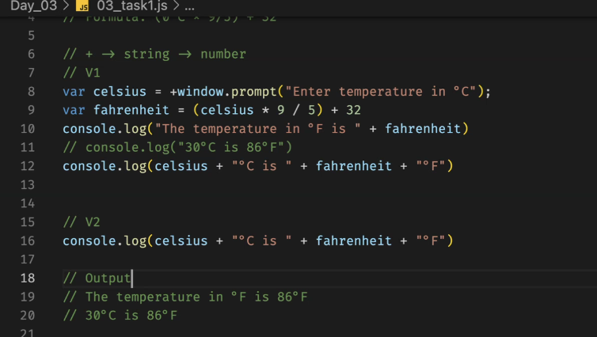

# 🌐 HTTP/2.0
✅ Based on TCP (Transmission Control Protocol)

📦 Binary Protocol (faster parsing than HTTP/1.1's text-based format)

↔️ Multiplexing: Allows multiple requests/responses in one connection

❗ Head-of-line (HOL) blocking at the TCP level — one lost packet can block others

🧾 Header compression using HPACK

🔒 TLS is optional but almost always used in practice

🚀 Widely supported by all modern browsers and servers

🔗 Uses a single TCP connection per origin

# HTTP/3.0
- Based on QUIC (Quick UDP Internet Connections) — runs over UDP, not TCP

-  Eliminates TCP-level HOL blocking (QUIC handles packet loss more gracefully)

- TLS 1.3 is built-in to QUIC — encryption is mandatory

🔁 Faster connection establishment (0-RTT for repeat connections)

🔒 Better security model with integrated TLS

🔁 Multiplexing without HOL blocking even under packet loss

🔄 Uses QPACK for header compression (optimized for QUIC)

🌍 Still rolling out — supported in major browsers, but some networks/firewalls block UDP

🧰 Better for mobile and unreliable networks due to improved loss recovery
